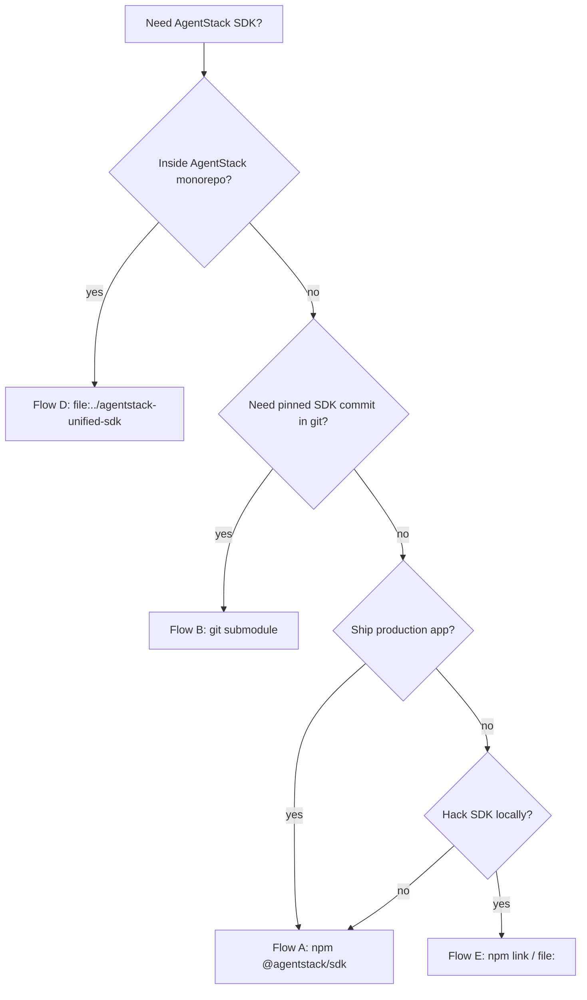

# SDK integration flows — all ways to consume `@agentstack/sdk`

**Genetic tag:** `repo.platform.sdk.integration_flows.gen1`  
**Mirror:** https://github.com/agentstacktech/agentstack-sdk

One-page map of **every supported way** to depend on the SDK, when to pick each, and what to run after install.

---

## Decision tree



---

## Flow A — npm (default for apps)

**When:** Production and most integrators. Released versions on [npm](https://www.npmjs.com/package/@agentstack/sdk).

```bash
npm install @agentstack/sdk
# optional React:
npm install @agentstack/react @tanstack/react-query
```

```typescript
import { AgentStackSDK, resolveAgentStackApiBase } from '@agentstack/sdk';

const sdk = new AgentStackSDK({
  apiBase: resolveAgentStackApiBase(),
  apiKey: process.env.AGENTSTACK_API_KEY,
  projectId: Number(process.env.AGENTSTACK_PROJECT_ID),
});

await sdk.platform.auth.login({ email, password });
sdk.updateProjectId(/* active project */);
```

| Step | Doc |
|------|-----|
| Env + API base | [quick-start.md](./quick-start.md) |
| `projectId` / headers | [PROJECT_CONTEXT.md](./PROJECT_CONTEXT.md) |
| No admin for tenants | [INTEGRATOR_SCOPE.md](./INTEGRATOR_SCOPE.md) |
| AI discover | [AGENTS.md](../AGENTS.md) |

**Subpaths:** `@agentstack/sdk/capability-tasks`, `@agentstack/sdk/manifest`, `@agentstack/sdk/commerce/*`, `@agentstack/sdk/economy` — see `package.json` `exports`.

---

## Flow B — git submodule (vendored source)

**When:** Pin exact SDK commit, air-gapped CI, fork SDK alongside app, co-development.

**Remote:** `https://github.com/agentstacktech/agentstack-sdk.git`  
**Default path:** `vendor/agentstack-sdk`  
**Lock file:** `sdk.lock.json` (commit SHA + `file:` paths)

```bash
# From your app repo (git required):
git submodule add https://github.com/agentstacktech/agentstack-sdk.git vendor/agentstack-sdk
git submodule update --init
cd vendor/agentstack-sdk && git checkout v0.4.13

node vendor/agentstack-sdk/scripts/submodule-add-sdk.mjs --target . --tag v0.4.13
node vendor/agentstack-sdk/scripts/link-sdk-deps.mjs --target .
cd vendor/agentstack-sdk && npm install && npm run build
npm install   # in app root
```

`package.json` after `link-sdk-deps`:

```json
{
  "dependencies": {
    "@agentstack/sdk": "file:vendor/agentstack-sdk/packages/core",
    "@agentstack/react": "file:vendor/agentstack-sdk/packages/react"
  }
}
```

| Script | Purpose |
|--------|---------|
| `submodule-add-sdk.mjs` | Submodule + `sdk.lock.json` |
| `link-sdk-deps.mjs` | Wire `file:` in app `package.json` |
| `doctor-sdk-submodule.mjs` | Drift + `dist` check |
| `bootstrap-submodule-consumer.mjs` | All-in-one |

Full guide: [SUBMODULE_CONSUMER.md](./SUBMODULE_CONSUMER.md) · monorepo [docs/sdk/SDK_SUBMODULE_INTEGRATION.md](../../docs/sdk/SDK_SUBMODULE_INTEGRATION.md)

**CI:** `actions/checkout` with `submodules: recursive` → build `vendor/agentstack-sdk` → `npm install` in app.

---

## Flow C — platform submodule (full AgentStack)

**When:** You vendor the whole platform repo and want kit + core + SDK paths.

```bash
git submodule add https://github.com/agentstacktech/AgentStack.git platform/AgentStack
```

SDK path inside monorepo: `platform/AgentStack/agentstack-unified-sdk/packages/core` — use `file:` deps or work inside that tree. Prefer **Flow B** if you only need the SDK mirror (smaller clone).

---

## Flow D — AgentStack monorepo sibling (this repo)

**When:** You clone [agentstacktech/AgentStack](https://github.com/agentstacktech/AgentStack) and run `agentstack-frontend`, `agentstack-core`, etc.

```json
{
  "dependencies": {
    "@agentstack/sdk": "file:../agentstack-unified-sdk/packages/core",
    "@agentstack/react": "file:../agentstack-unified-sdk/packages/react"
  }
}
```

- No submodule inside monorepo — direct path dependency.
- Frontend `shared/sdk-client.ts` uses `sdkAudience: 'platform_operator'` for ops UI.
- After SDK changes: `cd agentstack-unified-sdk && npm run build`.

---

## Flow E — local SDK development (`npm link`)

**When:** You develop SDK packages and test in another app on the same machine.

```bash
cd agentstack-unified-sdk/packages/core
npm run build
npm link

cd your-app
npm link @agentstack/sdk
```

Or use `file:` to local path without link:

```json
"@agentstack/sdk": "file:../agentstack-unified-sdk/packages/core"
```

Rebuild SDK after TS changes. See [../PUBLISHING.md](../PUBLISHING.md).

---

## Flow F — maintain / publish SDK (AgentStack team)

**When:** Cutting a release to npm and the public mirror.

1. Bump `AGENTSTACK_CORE_VERSION` in monorepo `shared/constants.py`.
2. `cd agentstack-unified-sdk/packages/core && npm run sync:agentstack-version`
3. `npm run build` + tests + `check:docs-urls` in `agentstack-unified-sdk`.
4. `git subtree split -P agentstack-unified-sdk` → push `agentstacktech/agentstack-sdk`.
5. Tag `v0.4.x` on mirror → GitHub Release → npm publish.

Runbook: [docs/sdk/SDK_MIRROR_PUBLISH_RUNBOOK.md](../../docs/sdk/SDK_MIRROR_PUBLISH_RUNBOOK.md)

---

## Flow G — Python (`agentstack-sdk`)

**When:** Python services (parity growing; TypeScript SDK is the reference for AI).

```bash
pip install agentstack-sdk
```

```python
sdk = AgentStackSDK(
    api_base="https://agentstack.tech/api",
    api_key="...",
)
```

See `packages/python/README.md` and monorepo `docs/ecosystem/PYTHON_SDK_PARITY.md`.

---

## Flow H — AI / automation (no app install)

**When:** Agents, scripts, MCP tools.

| Entry | Use |
|-------|-----|
| [AGENTS.md](../AGENTS.md) | Bootstrap + anti-patterns |
| `sdk.getModuleCatalog()` | Discover modules before calling APIs |
| `resolveAgentStackApiBase()` | Production API URL |
| `assertProjectIdConfigured(sdk)` | Guard missing scope |
| MCP `https://agentstack.tech/mcp` | Server-side actions |
| [examples/ai/](../examples/ai/) | Runnable recipes |

Protocol: monorepo [AGENT_PROTOCOL_QUICKSTART.md](https://github.com/agentstacktech/AgentStack/blob/master/docs/AGENT_PROTOCOL_QUICKSTART.md).

---

## Runtime checklist (any flow)

After the package resolves (`npm install` or `file:` + build):

1. **API base** — `resolveAgentStackApiBase()` or `AGENTSTACK_API_BASE=https://agentstack.tech/api`
2. **Auth** — `sdk.platform.auth.login` or tokens + `sdk.setAuthToken`
3. **Project scope** — `projectId` / `sdk.updateProjectId` → [PROJECT_CONTEXT.md](./PROJECT_CONTEXT.md)
4. **Calls** — prefer `sdk.platform.*` / `sdk.protocol` over raw `fetch`
5. **Tenant apps** — do not use `sdk.admin` ([INTEGRATOR_SCOPE.md](./INTEGRATOR_SCOPE.md))

---

## Compare at a glance

| Flow | Pin commit | npm registry | Build SDK locally | Typical user |
|------|------------|--------------|-------------------|--------------|
| A npm | via version | yes | no | App integrators |
| B submodule | yes | no | yes | Git-first teams |
| C platform submodule | yes | no | yes | Platform fork |
| D monorepo sibling | branch | no | yes | AgentStack devs |
| E link / file: | path | no | yes | SDK contributors |
| F publish | tag | yes | yes | AgentStack release |
| G Python | pip version | yes | no | Python backends |
| H AI/MCP | n/a | optional | no | Agents |
