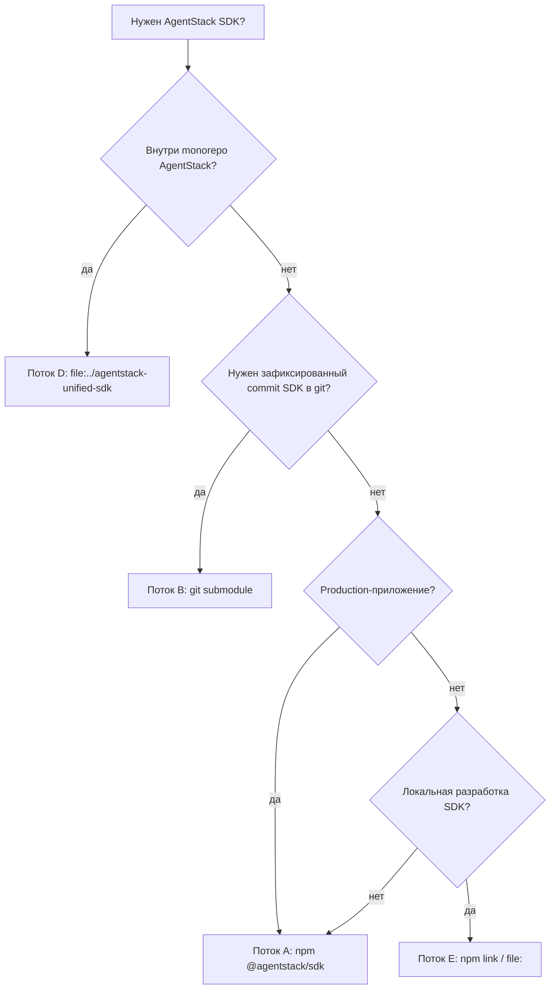

# Потоки интеграции SDK — все способы подключить `@agentstack/sdk`

**Genetic tag:** `repo.platform.sdk.integration_flows.gen1`  
**EN:** [SDK_INTEGRATION_FLOWS.md](./SDK_INTEGRATION_FLOWS.md)  
**Зеркало:** https://github.com/agentstacktech/agentstack-sdk

Одна страница: **каждый поддерживаемый способ** зависимости, когда выбирать, что запустить после установки.

---

## Дерево решений



---

## Поток A — npm (по умолчанию)

**Когда:** production и большинство интеграторов. Версии на [npm](https://www.npmjs.com/package/@agentstack/sdk).

```bash
npm install @agentstack/sdk
npm install @agentstack/react @tanstack/react-query   # опционально
```

```typescript
import { AgentStackSDK, resolveAgentStackApiBase } from '@agentstack/sdk';

const sdk = new AgentStackSDK({
  apiBase: resolveAgentStackApiBase(),
  apiKey: process.env.AGENTSTACK_API_KEY,
  projectId: Number(process.env.AGENTSTACK_PROJECT_ID),
});

await sdk.platform.auth.login({ email, password });
sdk.updateProjectId(/* активный проект */);
```

| Шаг | Док |
|-----|-----|
| Env + API | [quick-start_ru.md](./quick-start_ru.md) |
| `projectId` | [PROJECT_CONTEXT_ru.md](./PROJECT_CONTEXT_ru.md) |
| Без admin для тенанта | [INTEGRATOR_SCOPE_ru.md](./INTEGRATOR_SCOPE_ru.md) |
| AI | [AGENTS.md](../AGENTS.md) |

**Subpaths:** `@agentstack/sdk/capability-tasks`, `manifest`, `commerce/*`, `economy` — см. `package.json` `exports`.

---

## Поток B — git submodule

**Когда:** точный commit SDK, air-gapped CI, форк SDK рядом с app.

**Remote:** `https://github.com/agentstacktech/agentstack-sdk.git`  
**Путь:** `vendor/agentstack-sdk`  
**Lock:** `sdk.lock.json`

```bash
git submodule add https://github.com/agentstacktech/agentstack-sdk.git vendor/agentstack-sdk
git submodule update --init
cd vendor/agentstack-sdk && git checkout v0.4.13

node vendor/agentstack-sdk/scripts/bootstrap-submodule-consumer.mjs --target . --tag v0.4.13
npm install
```

| Скрипт | Назначение |
|--------|------------|
| `submodule-add-sdk.mjs` | Submodule + lock |
| `link-sdk-deps.mjs` | `file:` в package.json |
| `doctor-sdk-submodule.mjs` | Проверка drift / dist |
| `bootstrap-submodule-consumer.mjs` | Всё в одном |

Подробно: [SUBMODULE_CONSUMER_ru.md](./SUBMODULE_CONSUMER_ru.md)

**CI:** `actions/checkout` с `submodules: recursive` → build SDK → `npm install` в app.

---

## Поток C — submodule всей платформы

```bash
git submodule add https://github.com/agentstacktech/AgentStack.git platform/AgentStack
```

Путь SDK: `platform/AgentStack/agentstack-unified-sdk/packages/core`. Если нужен только SDK — предпочтите **поток B**.

---

## Поток D — sibling в monorepo AgentStack

```json
{
  "dependencies": {
    "@agentstack/sdk": "file:../agentstack-unified-sdk/packages/core",
    "@agentstack/react": "file:../agentstack-unified-sdk/packages/react"
  }
}
```

- Без submodule внутри monorepo.
- Frontend: `sdkAudience: 'platform_operator'`.
- После правок SDK: `cd agentstack-unified-sdk && npm run build`.

---

## Поток E — локальная разработка (`npm link`)

```bash
cd agentstack-unified-sdk/packages/core && npm run build && npm link
cd your-app && npm link @agentstack/sdk
```

Или `"@agentstack/sdk": "file:../agentstack-unified-sdk/packages/core"`. См. [PUBLISHING.md](../PUBLISHING.md).

---

## Поток F — publish SDK (команда AgentStack)

1. Bump `AGENTSTACK_CORE_VERSION` в `shared/constants.py`.
2. `npm run sync:agentstack-version` в `packages/core`.
3. `npm run build` + `check:docs-urls`.
4. Subtree push → `agentstacktech/agentstack-sdk`, tag, npm.

Runbook: [SDK_MIRROR_PUBLISH_RUNBOOK.md](../../docs/sdk/SDK_MIRROR_PUBLISH_RUNBOOK.md)

---

## Поток G — Python

```bash
pip install agentstack-sdk
```

TypeScript SDK — референс для AI. См. `packages/python/README.md`.

---

## Поток H — AI / automation

| Вход | Использование |
|------|----------------|
| [AGENTS.md](../AGENTS.md) | Bootstrap (EN) |
| `getModuleCatalog()` | Discovery |
| `resolveAgentStackApiBase()` | Production URL |
| `assertProjectIdConfigured(sdk)` | Guard scope |
| MCP `https://agentstack.tech/mcp` | Действия на сервере |

---

## Чеклист после установки (любой поток)

1. **API base** — `resolveAgentStackApiBase()` или `AGENTSTACK_API_BASE=https://agentstack.tech/api`
2. **Auth** — `sdk.platform.auth.login` или токены
3. **Project** — `projectId` / `updateProjectId` → [PROJECT_CONTEXT_ru.md](./PROJECT_CONTEXT_ru.md)
4. **Вызовы** — `sdk.platform.*` / `sdk.protocol`, не сырой `fetch`
5. **Тенант** — не `sdk.admin` → [INTEGRATOR_SCOPE_ru.md](./INTEGRATOR_SCOPE_ru.md)

---

## Сравнение

| Поток | Pin commit | npm | Сборка SDK | Кто |
|-------|------------|-----|------------|-----|
| A npm | версия | да | нет | Интеграторы |
| B submodule | да | нет | да | Git-first |
| C platform | да | нет | да | Форк платформы |
| D monorepo | ветка | нет | да | Dev AgentStack |
| E link | path | нет | да | Авторы SDK |
| F publish | tag | да | да | Release |
| G Python | pip | да | нет | Python |
| H AI/MCP | — | опц. | нет | Агенты |
